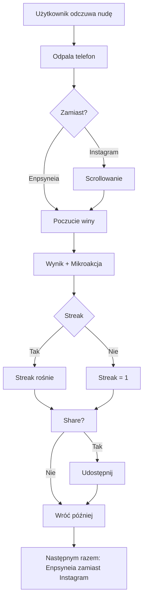

# 🎯 User Journey Map: Enpsyneia Check In

**Data:** 2026-03-22 (zaktualizowana wersja)
**Projekt:** Enpsyneia Check In
**Właściciel:** Krzysztof Kowalski
**Etap produkt:** MVP - z kontami użytkowników

---

## ⚠️ KLUCZOWE ZMIANY

### Zmiana paradygmatu

| Standardowy Etap | Wersja poprzednia | Wersja aktualna |
|-----------------|-------------------|-----------------|
| Stage 2: Sign-Up | **NIE ISTNIEJE** - od razu formularz | **ISTNIEJE** - Supabase Auth (Magic Link) |
| Stage 7: Conversion | **NIE ISTNIEJE** - brak modelu monetyzacji | **NIE ISTNIEJE** - Brand Building |
| **NOWE: Habit Loop** | **NIE ISTNIEJE** | **ISTNIEJE** - streak counter |
| **NOWE: Trigger** | Brak | Social media replacement |

**Konsekwencja:** Mierzymy inne metryki:
- ✅ Engagement (ile razy wraca)
- ✅ Time-to-first-value (< 2 minuty)
- ✅ NOWE: Habit Rate (% używających zamiast social media)
- ✅ Streak retention (ile dni z rzędu)
- ❌ Conversion rate (nie dotyczy - brand building)

---

### NOWE: Habit Loop Journey

```
┌─────────────────────────────────────────────────────────────────────┐
│                    HABIT LOOP JOURNEY                               │
├─────────────────────────────────────────────────────────────────────┤
│                                                                     │
│  TRIGGER: Użytkownik czuje nudę/pustkę                            │
│       │                                                              │
│       ▼                                                              │
│  ┌─────────────────────────────────────────────────────────────┐   │
│  │ ALTERNATIVE: "Co robię zamiast social media?"               │   │
│  │                                                              │   │
│  │ Option A: Instagram/TikTok ──▶ Scroll ──▶ Poczucie winy   │   │
│  │ Option B: Enpsyneia       ──▶ Check-in ──▶ Działanie       │   │
│  │                                                              │   │
│  └─────────────────────────────────────────────────────────────┘   │
│       │                                                              │
│       ▼                                                              │
│  ROUTINE: Check-in (30 sekund)                                     │
│       │                                                              │
│       ▼                                                              │
│  REWARD: Mikroakcja + poczucie spełnienia + streak increment       │
│       │                                                              │
│       ▼                                                              │
│  CONTINUATION: Użytkownik wraca następnym razem                    │
│                                                                     │
└─────────────────────────────────────────────────────────────────────┘
```

---

### Success Metric (Co to jest "sukces użytkownika"?)

_Użytkownik uzna, że aplikacja jest wartościowa, jeśli:_

→ **W mniej niż 2 minuty od otwarcia otrzyma konkretną mikroakcję, która pasuje do jego obecnego stanu i od razu wie, co ma zrobić**

**NOWE - dodatkowy sukces:**

→ **Użytkownik wybiera aplikację ZAMIAST social media** - to jest główny sukces mechanizmu nawykowego

**Uzasadnienie:** Z JTBD wiemy, że użytkownicy są przeciążeni i mają paraliż decyzyjny. Nie potrzebują analytics - potrzebują jednej jasnej odpowiedzi "co teraz zrobić". Dodatkowo, chcą znaleźć zdrowszą alternatywę dla nawykowego scrollowania.

---

## Stage 1: Landing (0-30 sekund) ⭐

**Cel:** Użytkownik w max 10 sekund zrozumie, czy ta aplikacja jest dla niego.

**NOWE - zmieniony messaging:**

**Co widzi:**
- **Headline:** "Czego teraz najbardziej potrzebujesz?" LUB "Zamiast scrollować - wybierz działanie"
- **Value Prop (max 2 linie):** "Wypełnij 6 prostych pytań i otrzymaj jedną konkretną mikroakcję na teraz. Dla osób, które chcą przestać nawykowo scrollować."
- **CTA:** "Sprawdź teraz" / "Rozpocznij check-in" / "Zamiast Instagram - tu"

**Elementy krytyczne:**
- [x] Headline wyjaśnia, co robi aplikacja (NIE "AI-Powered Wellness")
- [x] Value prop pokazuje czas: "2 minuty" lub "30 sekund"
- [x] NOWE: Value prop adresuje problem nawykowego scrollowania
- [x] CTA jest tylko jeden, bez rozdzielania na "Free" vs "Pro"
- [x] Brak slidera cookies / regulaminu przed wejściem

**Friction Points:**
- [x] Issue: Zbyt wiele tekstu na landing page
  - **Solution:** Max 3 linie tekstu, reszta to interakcja

- [x] Issue: Niejasne co aplikacja robi
  - **Solution:** Headline = pytanie użytkownika ("Czego teraz potrzebuję?") + "zamiast scrollować"

**Aha Moment:** User thinks _"To jest dokładnie to, czego szukam - ktoś mi powie, co mam zrobić, zamiast scrollować godzinę"_

**CTA Button:** [Rozpocznij Check-in] (primary, duży, kontrastowy)

---

## Stage 2: Sign-Up / First Use (0-60 sekund) ⭐ NOWE

**Cel:** Użytkownik może używać aplikacji bez konta LUB założyć konto dla lepszego doświadczenia.

**NOWE - opcje:**

**Opcja A: Bez konta (continue as guest)**
- [ ] Od razu formularz (6 pytań na suwakach)
- [ ] Minimalna instrukcja: "Przesuń suwak, jak się czujesz teraz"
- [ ] Progress indicator: "Pytanie 1 z 6"

**Opcja B: Z kontem (Supabase Magic Link)**
- [ ] "Zaloguj się lub załóż konto" (opcjonalnie)
- [ ] Wpisz e-mail → wyślij Magic Link
- [ ] Kliknij link → zalogowany
- [ ] Historia i streak dostępne na wielu urządzeniach

**WAŻNE:** Konto jest OPCJONALNE - użytkownik może używać bez logowania!

**Friction Points:**
- [x] Issue: Rejestracja = bariera wejścia
  - **Solution:** Guest mode = bez konta, konto = dodatkowe korzyści

- [x] Issue: Użytkownik nie wie, czy jego dane są bezpieczne
  - **Solution:** Mała informacja "Twoje dane są bezpieczne (Supabase)"

**Aha Moment (konto):** User logs in and sees _"Witaj z powrotem! Twój streak: 7 dni"_

---

## Stage 3: First Data Input (1-2 minuty) ⭐

**Cel:** Wypełnić 6 pytań i przejść do wyniku.

**Input type:** 6 suwaków (skala 1-5)

**Pytania (w kolejności):**
1. Poziom energii (1=wyczerpany, 5=pełen energii)
2. Przeciążenie bodźcami (1=spokojnie, 5=przebodźcowany)
3. Potrzeba ruchu vs odpocznienia (1=potrzebuję odpocząć, 5=potrzebuję ruchu)
4. Potrzeba samotności vs kontaktu (1=chcę być sam, 5=chcę być z ludźmi)
5. Poczucie sprawczości (1=nic nie mogę, 5=mogę wszystko)
6. Utknięcie w analizie (1=działam, 5=myślę bez końca)

**Elementy krytyczne:**
- [x] Suwak domyślnie na środku (3) - użytkownik może od razu kliknąć "Dalej"
- [x] Pytania proste, bez żargonu
- [x] Progress bar: "3/6" - widać postęp
- [x] Możliwość zmiany odpowiedzi przed submit
- [x] Help text pod każdym pytaniem: "Jak to rozumieć?"

---

## Stage 4: Processing (2-5 sekund)

**Cel:** Nie frustrować użytkownika czekaniem.

**Co widzi:**
- [x] Krótki komunikat: "Analizuję Twoje potrzeby..." (lub ikona)
- [x] Progress bar lub animacja (nie biały ekran!)
- [x] Szacunkowy czas: "To potrafi chwilę potrwać" (ale max 5 sekund)

---

## Stage 5: First Output (5-20 sekund) ⭐⭐⭐ NAJKRYTYCZNIEJSZY MOMENT

**Cel:** "Wow, to działa! To jest dokładnie to, czego potrzebowałem!"

**Output format:** Karty z wynikiem (nie PDF, nie dashboard)

**NOWE - dodane elementy mechanizmu nawykowego:**

**Co widzi użytkownik:**

**1. Podsumowanie stanu (1 linia):**
> "Czujesz się przebodźcowany z niską energią"

**2. Typ dnia (bold, duży):**
> 🌿 DZIEŃ WYCISZENIA

**3. Główna mikroakcja (najważniejsze!):**
> **Zrób 10 minut przerwy od ekranów.**
>
> Usiądź w ciszy, zamknij oczy, oddychaj głęboko.

**4. NOWE: Streak counter:**
> 🔥 Streak: 7 dni z rzędu!

**5. NOWE: "Zastąpiłeś social media" counter:**
> 💪 Zastąpiłeś Instagram 15x w tym tygodniu!

**6. Opcjonalnie - dodatkowa mikroakcja:**
> Dodatkowo: Napij się wody.

**7. NOWE: Share buttons:**
> [ 📤 Udostępnij ] [ 🔄 Wykonaj ponownie ]

**Elementy krytyczne:**
- [x] Wynik jest czytelny na pierwszy rzut oka (max 3 elementy)
- [x] Mikroakcja jest KONKRETNA i WYKONALNA (nie "rób coś dla siebie")
- [x] Jasne, że to jest "na teraz" - nie na jutro, nie na później
- [x] Opcja "Spróbuj ponownie" jeśli użytkownik źle ocenił stan
- [x] NOWE: Streak visible - motywuje do powrotu

**Export Options:**
- [x] NOWE: Share to social media (Twitter, LinkedIn)
- [x] Możliwość skopiowania tekstu: "Skopiuj rekomendację"

**Aha Moment:** User thinks _"Dokładnie! Teraz wiem, co mam zrobić. 10 minut ciszy - to mogę zrobić. I widzę, że mój streak rośnie!"_

**⏱️ TOTAL TIME FROM LANDING TO AHA:** 90-120 sekund (target: <2 min)

---

## Stage 6: Second Action (1-3 dni później) ⭐ NOWE

**Cel:** Zweryfikować, że Aha Moment był rzeczywisty - użytkownik wraca bez zewnętrznego triggera.

**NOWE - trigger nawykowy:**

| Moment | Co się dzieje |
|--------|---------------|
| Użytkownik czuje nudę | (trigger) |
| Odpala telefon | (automatyczne) |
| Zamiast Instagram → Enpsyneia | (alternative) |
| 30 sekund check-in | (cue + routine) |
| Mikroakcja + streak | (reward) |

**Trigger (jak wraca?):**
- [x] Widget w aplikacji: "Sprawdź jak się czujesz teraz"
- [x] Historia: widok poprzednich wpisów + streak
- [x] NOWE: Powiadomienia (opcjonalne - jeśli użytkownik zalogowany)
- [x] NOWE: Użytkownik musi sam zapamiętać, że aplikacja istnieje jako alternatywa

**Friction Points:**
- [x] Issue: Użytkownik zapomina o aplikacji
  - **Solution:** Streak counter = powrót, messaging "zamiast scrollować"

- [x] Issue: Nie ma powodu wracać
  - **Solution:** Streak pokazuje "7 dni z rzędu!", "Zastąpiłeś 15x social media"

**Aha Moment:** User comes back ON THEIR OWN and thinks _"Znów nie wiem co robić - zamiast Instagram włączę Enpsyneia"_

**Sukces:** 30%+ użytkowników raportuje "używam zamiast social media"

---

## Stage 7: Habit Loop (ciągły) ⭐⭐⭐ NOWE

**Cel:** Użytkownik tworzy nawyk - zamiast scrollować, otwiera Enpsyneia.

```
┌─────────────────────────────────────────────────────────────┐
│                    HABIT LOOP                               │
├─────────────────────────────────────────────────────────────┤
│                                                             │
│  Trigger: Nuda, pustka, "coś zrobię na telefonie"          │
│       │                                                    │
│       ▼                                                    │
│  Decision: Instagram vs Enpsyneia                          │
│       │                                                    │
│       ▼                                                    │
│  Action: Check-in (30 sekund)                              │
│       │                                                    │
│       ▼                                                    │
│  Reward: Mikroakcja + streak + "zastąpiłem social media"  │
│       │                                                    │
│       ▼                                                    │
│  Loop: Następnym razem - pamiętam o Enpsyneia             │
│                                                             │
└─────────────────────────────────────────────────────────────┘
```

**Elementy wspierające nawyk:**

| Element | Jak działa |
|---------|-------------|
| Streak counter | Widzę ile dni wytrwałem - nie chcę przerwać |
| "Zastąpiłem Xx" | Widzę ile razy wybrałem aplikację zamiast social media |
| Share buttons | Dzielę się osiągnięciami - social proof |
| Quick time | 30 sekund vs 30 minut scrollowania - convenience |

---

## Stage 8: Conversion - NIE DOTYCZY (Brand Building)

**Ten projekt nie ma kont premium lub płatności.**

Brak monetyzacji oznacza:
- ❌ Nie ma trial-to-paid conversion
- ❌ Nie ma upgrade flow
- ❌ Nie ma feature gating
- ✅ Zamiast: Brand Building - użytkownik poleca aplikację

**To jest celowe dla Brand Building Strategy** - projekt służy budowaniu marki, nie zarabianiu.

---

## 🔴 Summary Metrics

| Metryka | NOWE | Cel | Uwagi |
|---------|------|-----|-------|
| Landing → First Input | | >60% | % użytkowników którzy zaczynają wypełniać formularz |
| First Input → First Output | | >80% | % użytkowników którzy kończą formularz |
| Time from Landing to AHA | | <2 min | Critical success metric |
| Aha Moment survey | | >70% "tak, to było użyteczne" | Jeden przycisk po wyniku |
| Day 7 Return Rate | | >20% | % użytkowników wracających po 7 dniach |
| **NOWE: Habit Rate** | ✅ | >30% | % użytkowników którzy używają ZAMIAST social media |
| **NOWE: Streak Retention** | ✅ | >40% | % użytkowników z streak > 7 dni |
| **NOWE: Social Replacement** | ✅ | >40% | Ankieta: "Używasz zamiast Instagram?" |

---

## 🚩 Biggest Friction Point

**Brak powiadomień = użytkownik zapomina o aplikacji**

**NOWE - rozwiązanie:**
- Streak counter = powrót do aplikacji
- Messaging "zamiast scrollować" = trigger
- Opcjonalne powiadomienia (jeśli konto)

---

## ⚡ Quick Wins (zmiany które poprawią konwersję w <4h)

1. **Zmniejsz formularz do 4 pytań** - mniej friction, szybciej do wyniku
2. **Dodaj etykiety do suwaków** - "1=Zupełnie nie" | "5=Bardzo"
3. **Dodaj przykłady pod pytaniami** - "energia: 1=ledwo wstajesz"
4. **Progress bar widoczny cały czas** - "2/6 - jeszcze chwila"
5. **Dodaj streak counter** - widoczny na wyniku
6. **Dodaj share buttons** - "pochwal się streakem"

---

## 🔄 Co należy zmienić przed implementacją

| Problem | NOWE | Rekomendacja |
|---------|------|--------------|
| Brak monetyzacji | ✅ Cel = Brand Building | Nie wymaga zmian |
| 6 pytań to za dużo | | Zredukuj do 4 pytań core |
| Brak powiadomień | ✅ Opcjonalne dla kont | Dodaj w v2 |
| Nie wiadomo, czy dane są bezpieczne | ✅ Supabase | Dodaj informację |
| NOWE: Brak mechanizmu nawykowego | ✅ | Dodaj streak counter |

---

## 📊 Post-Launch Monitoring (dla MVP)

```
Daily:
□ Landing → First input: ___% (target: >60%)
□ First input → First output: ___% (target: >80%)
□ Time to first output: ___ sek (target: <120)

Weekly:
□ Day 1 Return Rate: ___% (target: >15%)
□ Day 7 Return Rate: ___% (target: >20%)
□ Aha Moment "useful" rate: ___% (target: >70%)
□ Habit Rate: ___% (target: >30%) [NOWE]
□ Streak > 7 days: ___% (target: >40%) [NOWE]

Monthly:
□ Social Replacement Survey: ___% (target: >40%) [NOWE]
```

---

## NOWE: User Journey Diagram



---

*Dokument wygenerowany w ramach workflow WF_User_Journey_Map (zaktualizowana wersja)*
