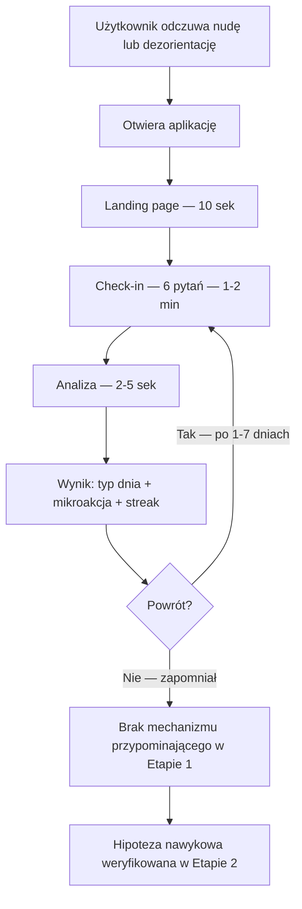

# User Journey Map — Enpsyneia Check In

**Data:** 2026-03-22 (zaktualizowana 2026-04-12)
**Projekt:** Enpsyneia Check In
**Etap produktu:** MVP — Etap 1 (localStorage, brak kont)

---

## Definicja sukcesu użytkownika

Użytkownik uzna aplikację za wartościową, jeśli w mniej niż 2 minuty od otwarcia otrzyma konkretną mikroakcję dopasowaną do swojego obecnego stanu i od razu będzie wiedział co zrobić.

Hipoteza dodatkowego sukcesu: użytkownik sięga po aplikację zamiast social media. To założenie wymaga weryfikacji na realnych użytkownikach w Etapie 2.

---

## MVP Flow — Etap 1

### Stage 1: Landing (0–30 sekund)

**Cel:** Użytkownik rozumie w 10 sekund czy aplikacja jest dla niego.

**Co widzi:**
- Nagłówek (kanoniczna wersja Etapu 1): **„Czego teraz najbardziej potrzebujesz?"** — wariant „Zamiast scrollować — wybierz działanie" jako opcja A/B po launchu
- Value prop (max 2 linie): „Wypełnij 6 prostych pytań i otrzymaj jedną konkretną mikroakcję. W mniej niż 2 minuty."
- Jeden przycisk CTA: „Rozpocznij check-in"

**Elementy krytyczne:**
- Nagłówek wyjaśnia co robi aplikacja — nie żargon, nie „AI-Powered Wellness"
- Value prop pokazuje czas: „2 minuty"
- Jeden CTA, brak rozgałęzień (brak „Free" vs „Pro", brak logowania)
- Brak cookies / regulaminu przed wejściem

**Friction:**
- Za dużo tekstu → max 3 linie, reszta to interakcja

**Aha Moment:** „To jest dokładnie to — ktoś mi powie co mam zrobić"

---

### Stage 2: Check-in — 2 bloki po 3 pytania (< 2 minuty)

**Cel:** Użytkownik wypełnia 6 pytań w 2 blokach i przechodzi do wyniku.

**Co widzi:**
- Blok 1 (energy, overload, paralysis): 3 suwaki jednocześnie na ekranie
- Blok 2 (movement, social, agency): 3 suwaki jednocześnie na ekranie
- Help text pod każdym pytaniem (szary, mały font)
- Progress bar: „Blok 1 z 2" / „Blok 2 z 2"
- Przycisk „Dalej" na Bloku 1, „Zobacz wynik" na Bloku 2
- Układ przewijalny — priorytety: wygoda i odstępy, nie upychanie

**Elementy krytyczne:**
- Suwaki domyślnie na środku (3) — można kliknąć „Dalej" bez zmiany
- Help text zawsze widoczny — nie ukryty za ikoną
- Możliwość cofnięcia się do poprzedniego bloku
- Progress bar widoczny przez cały czas

**Friction:**
- Suwaki nieczytelne na dotyk → testować na telefonie przed deploy
- Pytania niejasne → help text jest obowiązkowy

**Aha Moment:** „To szybsze niż myślałem"

---

### Stage 3: Analiza (2–5 sekund)

**Cel:** Użytkownik nie frustruje się czekaniem.

**Co widzi:**
- Komunikat: „Analizuję Twoje potrzeby…"
- Progress bar lub prosta animacja — nie biały ekran

---

### Stage 4: Wynik (5–20 sekund) ⭐ Najkrytyczniejszy moment

**Cel:** Użytkownik natychmiast wie co zrobić.

**Co widzi:**
1. Podsumowanie stanu (1 linia): „Czujesz się przebodźcowany z niską energią"
2. Typ dnia (duży, wyróżniony): „🌿 Twój dzień wygląda jak Dzień Wyciszenia"
3. Uzasadnienie wyniku (1 zdanie bezpośrednio pod typem dnia): „Twój poziom przeciążenia bodźcami jest wysoki — ciało i umysł potrzebują teraz spokoju."
4. Mikroakcja (konkretna, natychmiastowa): „Zrób 10 minut przerwy od ekranów. Usiądź w ciszy, zamknij oczy."
5. Streak counter: „🔥 7 dni z rzędu"
6. Przycisk: „Wykonaj ponownie"

**Elementy krytyczne:**
- Wynik czytelny na telefonie bez scrollowania
- Mikroakcja konkretna i wykonalna teraz — nie „zadbaj o siebie"
- Jasne że rekomendacja jest na teraz, nie na jutro
- Typ dnia opisany jako podpowiedź, nie diagnoza

**Friction:**
- Wynik zbyt ogólny → mikroakcje muszą być napisane przed implementacją, nie generowane ad hoc

**Aha Moment:** „Dokładnie tego potrzebowałem. 10 minut ciszy — to mogę zrobić teraz."

**Całkowity czas: landing → wynik: 90–120 sekund**

---

### Stage 5: Powrót — hipoteza

**Cel:** Zrozumieć, pod jakimi warunkami użytkownik może wrócić bez zewnętrznego triggera.

Powrót użytkownika w Etapie 1 nie jest gwarantowany — nie ma powiadomień, nie ma konta, nie ma emaila. Poniżej opisano warunki, które mogą sprzyjać powrotowi. To są hipotezy, nie gotowy mechanizm.

**Warunki możliwego powrotu:**

| Warunek | Dlaczego może działać | Dlaczego może nie działać |
|---------|-----------------------|---------------------------|
| Streak counter był wysoki | Użytkownik nie chce przerywać serii | Bez powiadomienia użytkownik zapomina |
| Pierwszy wynik był trafny | Pozytywne skojarzenie z aplikacją | Jeden trafny wynik nie buduje nawyku |
| Użytkownik zapamiętał URL / dodał do ekranu głównego | Niska bariera dostępu | Wymaga świadomego działania przy pierwszej wizycie |
| Sytuacja triggera powtórzy się | Ten sam kontekst (nuda, dezorientacja) przywołuje skojarzenie | Bez przypomnienia konkuruje z Instagramem otwieranym automatycznie |

**Co mierzymy w Etapie 1:** Day 7 Return Rate (GA4) — jedyna twarda miara powrotu dostępna bez kont.

---

### Stage 6: Habit Loop — hipoteza do walidacji

Aplikacja może stać się nawykową alternatywą dla social media. Poniższy diagram opisuje pożądany mechanizm — nie potwierdzony empirycznie.

```
CUE               →   ROUTINE            →   REWARD
Nuda, pustka           Enpsyneia               Mikroakcja
„coś zrobię            check-in                + streak
 na telefonie"         (30 sek – 2 min)        + „zrobiłem coś
                                                 dla siebie"
```

**Co wspiera hipotezę w Etapie 1:**

| Element | Dostępny w Etapie 1 | Rola |
|---------|---------------------|------|
| Streak counter | Tak (localStorage) | Motywuje do powrotu — nie traci serii |
| Szybkość (<2 min) | Tak | Konkuruje czasem z otwarciem Instagrama |
| Konkretna mikroakcja | Tak | Reward — poczucie że coś zrobiłem |

**Czego brakuje w Etapie 1 do pełnej walidacji:**

| Brakujący element | Dlaczego istotny | Kiedy dostępny |
|-------------------|-----------------|----------------|
| Powiadomienia | Bez nich użytkownik musi pamiętać sam | Etap 2 (opcjonalne, przy koncie) |
| Dane o sesjach | Nie wiemy jak często użytkownik wraca | Etap 2 (Supabase) |
| Ankieta po 30 dniach | Nie możemy zapytać użytkownika bez emaila | Etap 2 |

Weryfikacja hipotezy nawykowej odbywa się w Etapie 2.

---

## Metryki sukcesu

### Etap 1 — mierzalne od pierwszego dnia

Metryki możliwe do śledzenia bez kont i backendu, przez GA4 i jeden przycisk feedbacku na ekranie wyniku. **Kanoniczne wartości docelowe: `docs/product/mvp-scope.md`.** Liczby poniżej muszą być zgodne z 04.

| Metryka | Cel | Źródło danych |
|---------|-----|---------------|
| Landing → start formularza | > 60% | GA4 event: form_start |
| Start → wynik (completion) | > 70% | GA4 event: result_shown |
| Time-to-first-value | < 2 minuty | GA4: czas między pageview a result_shown |
| Useful rating | > 60% | Przycisk „Czy to pomogło?" na ekranie wyniku |
| Day 7 Return Rate | > 20% | GA4: returning users po 7 dniach |

### Nie da się sensownie mierzyć w Etapie 1

Poniższe metryki wymagają kont użytkowników lub backendu. Zbieranie ich przez GA4 dałoby dane zbyt niepewne, żeby na nich polegać:

| Metryka | Dlaczego niedostępna | Kiedy możliwa |
|---------|----------------------|---------------|
| Habit Rate (użycie zamiast social media) | Wymaga ankiety powiązanej z kontem | Etap 2 |
| Streak Retention (streak > 7 dni) | localStorage czyszczone przez Safari, brak ciągłości między urządzeniami | Etap 2 |
| Powroty per użytkownik | GA4 nie rozróżnia niezalogowanych użytkowników niezawodnie | Etap 2 |
| Social Replacement Rate | Wymaga ankiety po 30 dniach użycia | Etap 2 |

---

## Biggest Friction Point

**Brak powiadomień = użytkownik zapomina o aplikacji.**

W Etapie 1 nie ma mechanizmu przypominającego. Jedyne co działa pasywnie to streak counter — użytkownik który wraca sam, widzi że nie chce przerywać serii. Nie rozwiązuje to problemu zimnego powrotu po pierwszej wizycie.

Mitygacja dostępna w Etapie 1: jasny messaging na landing page i ekranie wyniku — „dodaj do ekranu głównego".

Pełne rozwiązanie (opcjonalne powiadomienia) dostępne w Etapie 2 po założeniu konta.

---

## Post-Launch Monitoring

### Etap 1 — monitorujemy aktywnie

```
Dziennie:
□ Landing → start formularza: ___% (cel: >60%)
□ Start → wynik: ___% (cel: >70%)
□ Średni czas do wyniku: ___ sek (cel: <120)

Tygodniowo:
□ Day 7 Return Rate: ___% (cel: >20%)
□ Useful rating: ___% (cel: >60%)
□ Streak counter — czy w ogóle jest używany (czy użytkownicy wracają z wartością >1)
```

### Etap 2 — nie mierzymy jeszcze

```
(niedostępne bez kont i backendu)
□ Habit Rate
□ Streak Retention > 7 dni (wiarygodnie)
□ Social Replacement Rate
□ Powroty per użytkownik (dokładne)
```

---

## Flow diagram


